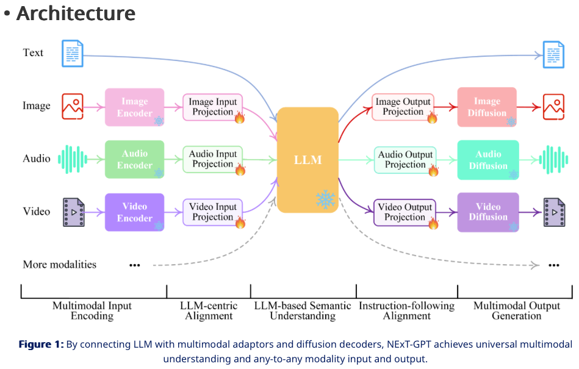
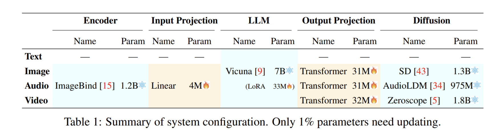
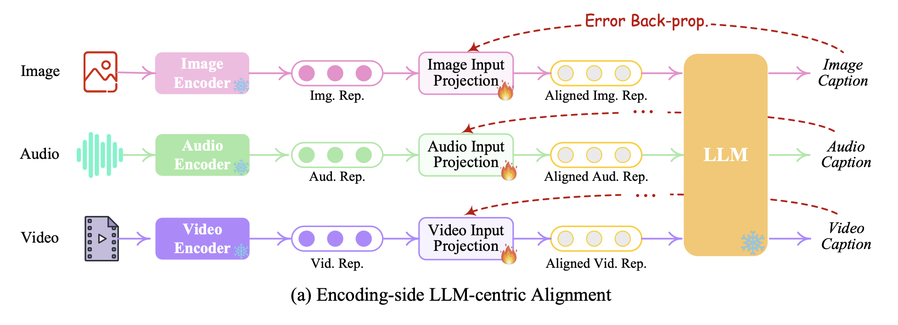
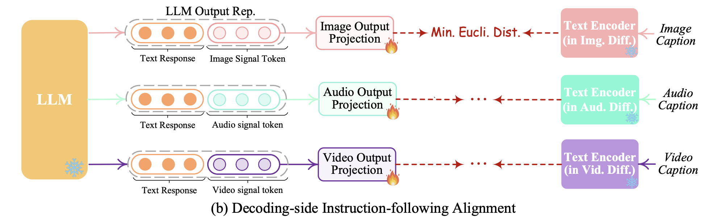
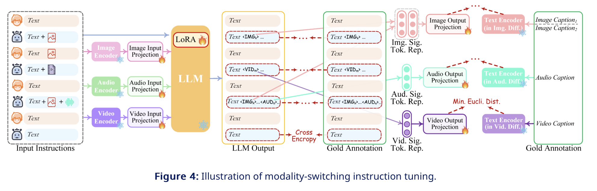

# NExT-GPT-Multimodal-LLM

While recently Multimodal Large Language Models (MM-LLMs) have made exciting strides, they mostly fall prey to the limitation of only input-side multimodal understanding, without the ability to produce content in multiple modalities. As we humans always perceive the world and communicate with people through various modalities, developing any-to-any MM-LLMs capable of accepting and delivering content in any modality becomes essential to human-level AI. To fill the gap, we present an end-to-end general-purpose any-to-any MM-LLM system, NExT-GPT. We connect an LLM with multimodal adaptors and different diffusion decoders, enabling NExT-GPT to perceive inputs and generate outputs in arbitrary combinations of text, images, videos, and audio. By leveraging the existing well-trained highly-performing encoders and decoders, NExT-GPT is tuned with only a small amount of parameter (1%) of certain projection layers, which not only benefits low-cost training and also facilitates convenient expansion to more potential modalities. Moreover, we introduce a modality-switching instruction tuning (MosIT) and manually curate a high-quality dataset for MosIT, based on which NExT-GPT is empowered with complex cross-modal semantic understanding and content generation. Overall, our research showcases the promising possibility of building an AI agent capable of modeling universal modalities, paving the way for more human-like AI research in the community.

There are three main tiers. 
## Multimodal Encoding Stage. 
Leveraging existing well-established models to encode inputs of various modalities. Here we take advantage of the ImageBind, which is a unified high-performance encoder across six modalities. Then, via the linear projection layer, different input representations are mapped into language-like representations that are comprehensible to the LLM.

## LLM Understanding and Reasoning Stage. 
An LLM is used as the core agent of NExT-GPT. Technically, we employ the Vicuna. LLM takes as input the representations from different modalities and carries out semantic understanding and reasoning over the inputs. It outputs 1) the textual responses directly, and 2) signal tokens of each modality that serve as instructions to dictate the decoding layers whether to generate multimodal contents, and what content to produce if yes.

## Multimodal Generation Stage. 
Receiving the multimodal signals with specific instructions from LLM (if any), the Transformer-based output projection layers map the signal token representations into the ones that are understandable to following multimodal decoders. Technically, we employ the current off-the-shelf latent conditioned diffusion models of different modal generations, i.e., Stable Diffusion (SD) for image synthesis, Zeroscope for video synthesis, and AudioLDM for audio synthesis.

If LLM identifies a certain modality content (except language) to be produced, a special type of token will be output indicating the activation of that modality; otherwise, no special token output means deactivation of that modality. 

## Lightweight Multimodal Alignment Learning

We design the system with mainly three tiers in loose coupling, and we only need to update the two projection layers at encoding side and decoding side.

### Encoding-side LLM-centric Multimodal Alignment. 
We align different inputting multimodal features with the text feature space, the representations that are understandable to the core LLM. This is thus intuitively named the LLM-centric multimodal alignment learning. To accomplish the alignment, we prepare the ‘X-caption’ pair (‘X’ stands for image, audio, or video) data from existing corpus and benchmarks. We enforce LLM to produce the caption of each input modality against the gold caption. Figure 3(a) illustrates the learning process.

### Decoding-side Instruction-following Alignment. 

On the decoding end, we have integrated pre-trained conditional diffusion models from external resources. Our main purpose is to align the diffusion models with LLM’s output instructions. However, performing a full-scale alignment process between each diffusion model and the LLM would entail a significant computational burden. Alternatively, we here explore a more efficient approach, decoding-side instruction-following alignment, as depicted in Figure 3(b). Specifically, since diffusion models of various modalities are conditioned solely on textual token inputs. This conditioning diverges significantly from the modal signal tokens from LLM in our system, which leads to a gap in the diffusion models’ accurate interpretation of the instructions from LLM. Thus, we consider minimizing the distance between the LLM’s modal signal token representations (after each Transformer-based project layer) and the conditional text representations of the diffusion models. Since only the textual condition encoders are used (with the diffusion backbone frozen), the learning is merely based on the purely captioning texts, i.e., without any visual or audio resources. This also ensures highly lightweight training.

### Modality-switching Instruction Tuning (MosIT)

Further instruction tuning (IT) is necessary to enhance the capabilities and controllability of LLM. To facilitate the development of any-to-any MM-LLM, we propose a novel Modality-switching Instruction Tuning (MosIT). As illustrated in Figure 4, when an IT dialogue sample is fed into the system, the LLM reconstructs and generates the textual content of input (and represents the multimodal content with the multimodal signal tokens). The optimization is imposed based on gold annotations and LLM's outputs. In addition to the LLM tuning, we also fine-tune the decoding end of NExT-GPT. We align the modal signal token representation encoded by the output projection with the gold multimodal caption representation encoded by the diffusion condition encoder. Thereby, the comprehensive tuning process brings closer to the goal of faithful and effective interaction with users.

 "Modality-switching Instruction Tuning (MosIT)" which is used to enhance the capabilities of a language model (LLM) in processing and responding to multimodal inputs—inputs that may include text, images, audio, and video. This is a process aimed at improving the language model's ability to interact with users by generating accurate textual responses to various types of inputs. Let's break it down:

Input Instructions: At the start, the system receives input instructions, which are text prompts that may be accompanied by various symbols representing different modalities, like images, audio, or video.

Encoding and Input Projection: For each modality (image, audio, video), there's an encoder and an input projection step, much like the encoding side you asked about earlier. This step turns raw media into a structured format and then aligns it with the text feature space of the LLM.

LLM Processing with LoRA: The LLM, enhanced with a technique called LoRA (Low-Rank Adaptation), processes the multimodal inputs and produces textual content as output.
LLM Output and Cross-Entropy with Gold Annotation: The textual output from the LLM is then compared to a "Gold Annotation," which is the correct or desired response. The comparison uses a method called "cross-entropy," which is a way to measure how well the LLM's output matches the gold standard.

Output Projection and Modality-Specific Text Encoders: The text output is projected for each modality and encoded with modality-specific text encoders, which might be part of diffusion models that have been adapted to work with text. The goal here is to align the LLM's output with the diffusion models' expected inputs.

Minimizing Euclidean Distance for Modality-Specific Representations: Like in the decoding-side process, there's an emphasis on minimizing the Euclidean distance between the LLM's output representations for each modality and the gold annotations. This step aims to refine the accuracy of the LLM's multimodal responses.
